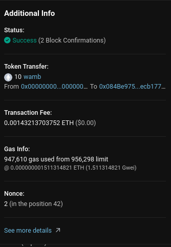
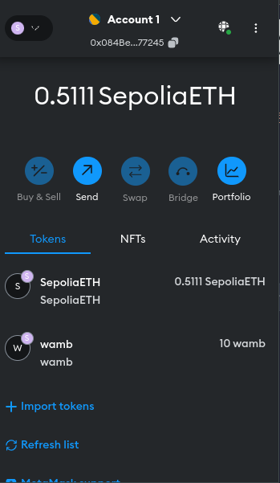

# wambsToken ERC-20 Token Contract

## Introduction

This repository contains a simple ERC-20 token implementation named `wambsToken`. The contract is written in Solidity and utilizes the OpenZeppelin library to inherit the ERC-20 standard functionalities. The `wambsToken` contract mints 10 tokens to the contract deployer upon deployment.

## What is ERC-20?

ERC stands for Ethereum Request for Comment. ERCs are standards proposed and approved by the Ethereum community to specify technical requirements for various use cases.

### ERC-20 Standard

ERC-20 is a standard that defines the technical specification of a fungible token. Fungible tokens are tokens where each unit is identical and interchangeable with any other unit. For example, 1 ETH is always equal to another 1 ETH, making ETH a fungible token. This is similar to fiat currencies where 1 USD is equal to another 1 USD.

In contrast, non-fungible tokens (NFTs) are unique and not interchangeable. Each NFT represents a distinct asset, making them non-fungible.

### Importance of ERC-20

Most tokens on the Ethereum blockchain adhere to the ERC-20 standard. This standardization allows developers to create applications that support all ERC-20 tokens without needing specialized code for each token. For example, decentralized exchanges like Uniswap can facilitate token swaps for any ERC-20 token because all tokens follow the same standard.

## Prerequisites

To interact with the `wambsToken` contract, you'll need the following:

1. **MetaMask**: A browser extension that serves as a cryptocurrency wallet and gateway to Ethereum-based applications.
2. **Sepolia Testnet**: A test network for Ethereum where you can deploy and interact with smart contracts without using real ETH.

## Contract Code

Here is the Solidity code for the `wambsToken` contract:

```solidity
// SPDX-License-Identifier: MIT
// Compiler: Solidity 0.8.0
pragma solidity ^0.8.0;

// Import the ERC20.sol file from the OpenZeppelin library
import "https://github.com/OpenZeppelin/openzeppelin-contracts/blob/master/contracts/token/ERC20/ERC20.sol";

// Define the contract wambsToken that extends ERC20
contract wambsToken is ERC20 {
    // Constructor function that takes two arguments, _name and _symbol
    constructor(string memory _name, string memory _symbol) ERC20(_name, _symbol){
        // Mint 10 tokens to the contract deployer
        _mint(msg.sender, 10 * 10**18);
    }
}
```

### Explanation

1. **License and Compiler Version**: The contract specifies the MIT license and Solidity compiler version 0.8.0.
2. **OpenZeppelin Import**: The contract imports the ERC20 implementation from the OpenZeppelin library.
3. **Contract Definition**: The `wambsToken` contract inherits from the ERC20 contract provided by OpenZeppelin.
4. **Constructor**: The constructor takes two arguments, `_name` and `_symbol`, which are passed to the ERC20 constructor. It mints 10 tokens (10 * 10^18, considering 18 decimal places) to the address deploying the contract.

## Deployment

To deploy the contract on the Sepolia Testnet, follow these steps:

1. **Install MetaMask**: Download and install the MetaMask extension for your browser.
2. **Connect to Sepolia Testnet**: Open MetaMask and switch to the Sepolia Testnet.
3. **Get Test ETH**: Acquire test ETH from a Sepolia faucet.
4. **Deploy Contract**: Use Remix IDE or another Ethereum development environment to deploy the contract with the desired token name and symbol.
 


## Interacting with the Contract

Once deployed, you can interact with the `wambsToken` contract using MetaMask or other Ethereum wallets. You can:

- Check the token balance of any address.
- Transfer tokens to other addresses.
- Approve and transfer tokens on behalf of another address.

By adhering to the ERC-20 standard, `wambsToken` ensures compatibility with a wide range of Ethereum applications and services.

## Viewing Tokens in MetaMask

You may notice that even though you minted tokens to your address, they don't show up in MetaMask.

This is because MetaMask cannot detect random ERC-20 token balances (since there are literally hundreds of thousands of them). They have a list of the most well-known ERC-20 tokens that they can show automatically, but apart from that, for your own tokens, you will usually need to tell MetaMask to add it to your wallet manually.

### Adding Your Token to MetaMask

To add your `wambsToken` to MetaMask, follow these steps:

1. **Copy Your Contract Address**: Obtain the address of your deployed `wambsToken` contract.
2. **Open MetaMask**: Go to the MetaMask extension in your browser.
3. **Import Tokens**:
   - Click on the `Assets` tab.
   - Scroll down and click on `Import Tokens`.
4. **Enter Token Details**:
   - Paste your `Token Contract Address`.
   - MetaMask should automatically detect the token name and decimals.
5. **Add Token**: Click `Add Custom Token`, then click `Import Tokens`.




Your token balance should now be visible in MetaMask!

## Conclusion

The `wambsToken` contract demonstrates a basic implementation of an ERC-20 token using the OpenZeppelin library. This standardized approach allows for seamless integration with various Ethereum-based applications and services, ensuring broad compatibility and ease of use. By following the steps provided, you can deploy your own ERC-20 token and view it in MetaMask.